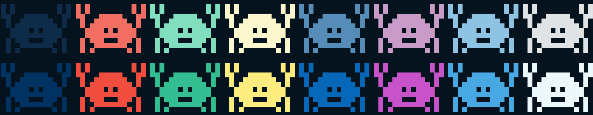

# Ferris

[Ferris](http://www.rustacean.net/) is the official mascot of the Rust programming language. This is just for fun. Based on the design by [YakoYakoYokuYoku](https://users.rust-lang.org/t/ferris-as-an-8-bit-sprite/25346).



## Run it

```sh
git clone https://github.com/ryanobeirne/ferris
cd ferris
cargo run
```